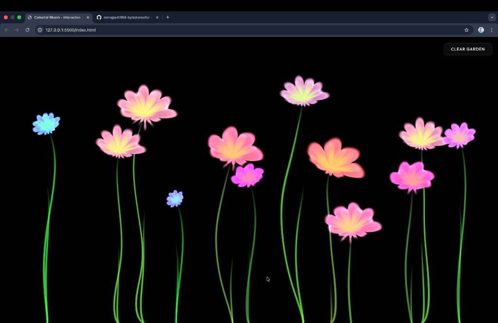

<div align="center">

# 🌸 Celestial Bloom 🌸

### *Where the Night Sky Meets Your Touch*



[](https://github.com/omrajputt369-byte/celestial-bloom)
[](https://github.com/omrajputt369-byte/celestial-bloom/stargazers)
[](https://threejs.org/)

---

#### [ ✨ Live Experience ](https://omrajputt369-byte.github.io/celestial-bloom/) · [ 🌌 View Shaders ](#tech-stack) · [ 🎵 Listen to the Bloom ](#features)

</div>

## 🪐 The Vision

**Celestial Bloom** is more than just a garden; it's a meditative journey into a digital cosmos. Every interaction plants a unique, procedurally generated flower that carries theessence of the stars. Designed with a deep focus on **visual excellence** and **smooth interactivity**, it transforms your screen into a vibrant, living canvas.

---

## 💎 Premium Features

- ✨ **Ethereal Generation** | No two flowers are ever the same. Each bloom features randomized petal structures, celestial color palettes, and unique scaling.
- 🎨 **Luminous Aesthetics** | A curated palette of magenta, deep violet, and cosmic blue set against a velvet night gradient.
- 🎵 **Harmonic Immersion** | A soulful, ambient soundtrack (Be My Baby) that triggers with your first touch, syncing the audio-visual experience.
- 📱 **Fluid Interactivity** | Fully responsive and optimized for both desktop clicks and mobile touches with zero-latency response.
- 🧼 **The Infinite Canvas** | A glassmorphism-styled control system allowing you to clear your garden and start anew in an instant.

---

## 🛠️ Built With

<div align="center">

| Core | Graphics | Styling | Typography |
| :--- | :--- | :--- | :--- |
| **Vanilla JS (ES6+)** | **Three.js** | **Modern CSS3** | **Outfit (Google Fonts)** |
| **Custom Shaders** | **WebGL** | **Glassmorphism** | **Inter-Medium** |

</div>

---

## 🚀 Step into the Garden

1. **Summon the Code**
   ```bash
   git clone https://github.com/omrajputt369-byte/celestial-bloom.git
   ```
2. **Ignite the Bloom**
   Simply open `index.html` in your browser.
3. **Become the Artist**
   Touch the void to create your first flower and let the music guide you.

---

<div align="center">

*Curated with ❤️ by [OM](https://github.com/omrajputt369-byte)*

**[GitHub](https://github.com/omrajputt369-byte)** • **[Portfolio](#)** • **[Twitter](#)**

</div>
